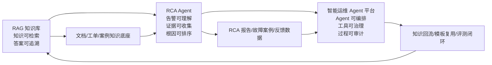

# AI Agent 工程师三项目开发时间线文档

生成日期：2026-06-17  
适用场景：AI Agent 工程师跳槽项目材料、面试复盘、项目说明书前置背景  
项目主线：基站相关内部 AI 项目从知识问答到告警根因分析，再到智能运维 Agent 平台的递进建设

## 1. 文档边界

本文是一份项目经历规划文档，用于把 2024.06 至今的内部 AI 项目组织成可信的软件工程叙事。文档中的技术栈和时间节点按公开技术成熟度做了校准，避免把尚未成熟或尚未发布的框架写进过早的项目阶段。

简历中可保留的核心逻辑是：

- 2024.06 - 2025.01：先建设 RAG 内部知识库，解决基站运维知识分散、检索慢、回答不可追溯的问题。
- 2025.02 - 2025.09：在知识库基础上建设基站告警根因分析 Agent，解决告警理解、证据收集、根因候选生成和工单报告生成问题。
- 2025.10 - 至今：将单点 Agent 平台化，建设智能运维 Agent 平台，解决多 Agent 编排、工具治理、人机审批、审计和评测问题。

注意事项：

- LangGraph v1 适合放在 2025.10 之后的平台化阶段；2025.10 之前建议写 LangGraph 0.x 或自研 DAG 编排。
- MCP 适合放在 2024.11 之后的调研，重点落在 2025.10 之后的平台工具治理，不建议写进 2024.06 的项目启动阶段。
- Milvus 建议写 Milvus 2.x，避免在 2024.06 阶段绑定过细版本。
- Qwen2/Qwen2.5 可以按时间逐步演进：2024.06 先写 Qwen2 或企业内训模型，2024.09 后再写 Qwen2.5。
- 指标建议写成可核验口径，例如 Top-3 根因命中率、引用覆盖率、告警收敛率、人工采纳率、平均诊断报告生成时间，不建议写绝对化的“自动准确定位 95% 根因”。

## 2. 三项目总体排期

| 阶段 | 时间 | 项目 | 核心目标 | 主要交付 |
|---|---:|---|---|---|
| 阶段一 | 2024.06 - 2025.01 | 基于 RAG 的内部知识库智能问答系统 | 建设基站运维知识底座 | 文档接入、混合检索、带引用问答、评测集、权限与审计 |
| 阶段二 | 2025.02 - 2025.09 | 基站告警根因分析 Agent | 将知识库能力扩展到告警诊断场景 | 告警收敛、上下文采集、RCA Agent、证据链、工单回写 |
| 阶段三 | 2025.10 - 至今 | 智能运维 Agent 平台 | 将多个运维 Agent 平台化管理 | Agent 编排、MCP 工具注册、人机审批、可观测、评测、治理 |

## 3. 详细开发时间线

### 2024.06：RAG 知识库立项与技术验证

开发内容：

- 梳理基站运维相关知识源，包括设备手册、基站告警字典、无线参数说明、传输故障处理 SOP、历史工单、割接方案和巡检记录。
- 设计知识库的基础数据模型：知识源、文档、分段、向量索引、权限标签、版本号、引用来源。
- 搭建最小可用 RAG POC：文档解析、文本切分、Embedding、向量检索、Prompt 拼接和问答接口。
- 对比 Milvus、FAISS、Elasticsearch 向量检索能力，最终建议选 Milvus 2.x 承载主向量检索，Elasticsearch/OpenSearch 承载 BM25 和日志类检索。
- 模型侧采用企业内训模型、Qwen2 或兼容 OpenAI API 的内网推理服务，避免早期绑定尚未稳定的平台功能。

遇到的问题：

- 文档格式复杂，存在 PDF 扫描件、Word 表格、网页、Excel 告警字典和图片说明。
- 直接按固定长度切分会破坏告警码、处理步骤和表格上下文。
- 运维人员对答案可信度要求高，不能只给自然语言答案，必须可追溯到文档来源。

解决方式：

- 将文档解析拆成结构化解析、OCR 兜底、表格行列保持、标题层级保留四类处理。
- 切分策略从固定窗口改为标题层级 + 语义段落 + 告警码保护规则。
- 在回答模板中强制输出引用来源、命中文档、段落编号和适用条件。

阶段交付：

- RAG POC 服务。
- 约 500 - 1000 条内部问答样例。
- 第一版文档入库规范和知识源清单。

### 2024.07：文档处理流水线建设

开发内容：

- 建设文档接入服务，支持手工上传、批量导入、定时同步和增量更新。
- 设计文档状态机：待解析、解析中、解析失败、待审核、已发布、已下线。
- 增加知识元数据：设备厂家、设备型号、网络制式、区域、专业线、文档版本、适用时间。
- 引入 Celery/Redis 或同类异步任务队列处理 OCR、切分、向量化、索引构建。
- 建立文档质量检查：空段落、乱码、重复段落、超长表格、缺失标题。

遇到的问题：

- 大文档解析耗时长，单接口同步处理容易超时。
- 同一厂商的手册版本重复，旧版知识和新版知识容易混入检索结果。
- 内部文档权限差异明显，部分文档只允许专家组或特定区域查看。

解决方式：

- 文档处理改为异步任务，前端轮询处理进度。
- 引入文档版本和生效时间字段，检索时优先命中最新有效版本。
- 在 chunk 级别写入权限标签，检索阶段和答案生成阶段都做权限过滤。

阶段交付：

- 第一版文档处理流水线。
- 文档解析失败重试和人工修复入口。
- 基础权限过滤机制。

### 2024.08：混合检索与回答质量优化

开发内容：

- 建设混合检索策略：向量召回 + BM25 关键词召回 + 元数据过滤。
- 引入 BGE-M3 作为中文和中英混合知识的 Embedding 候选模型。
- 引入 bge-reranker-v2-m3 或同类重排模型，对 Top-K 候选片段进行二阶段排序。
- 针对基站告警码、参数名、网元名、厂家术语建立词典和同义词规则。
- 构建回答后处理：引用校验、答案长度控制、不能回答时的兜底话术。

遇到的问题：

- 告警码、参数名这类短文本容易被纯向量检索漏召回。
- 模型会把相似告警的处理步骤混在一起，存在幻觉风险。
- 问题中经常包含内部简称，通用模型不能稳定理解。

解决方式：

- 使用混合检索提升短词、编号、英文缩写召回能力。
- 对回答增加“证据必须来自检索片段”的约束，未命中证据时返回建议检索方向。
- 建设基站领域词典，将 eNodeB、gNodeB、小区、RRU、BBU、传输链路等术语做归一化。

阶段交付：

- 混合检索服务。
- 重排服务。
- 告警码和专业术语词典。
- 第一版问答质量评测报表。

### 2024.09：知识库产品化和试点上线

开发内容：

- 建设 Web 问答界面，支持多轮问答、引用展开、原文定位、反馈按钮。
- 支持按专业线选择知识库，例如无线、传输、动力、核心网、网管平台。
- 增加用户反馈闭环：有用、无用、引用错误、答案过期、需要专家补充。
- 支持问答日志脱敏和审计留存。
- 在一个或两个区域进行试点，收集一线运维问题。

遇到的问题：

- 用户问题表达不规范，经常只有“某告警怎么处理”或截图中的半句话。
- 多轮问答中上下文容易污染，模型把上一个问题的站点信息带到新问题。
- 用户反馈初期很少，难以快速形成高质量评测数据。

解决方式：

- 增加问题改写模块，将口语化问题改写为标准检索 query。
- 多轮会话按任务边界截断，站点、小区、厂家等上下文设置有效轮次。
- 将低置信度回答和高频问题推送给专家审核，人工构造黄金问答集。

阶段交付：

- 试点版知识问答系统。
- 用户反馈闭环。
- 第一批高频问题和黄金问答集。

### 2024.10：评测体系与稳定性建设

开发内容：

- 建设离线评测集，覆盖告警解释、SOP 查询、参数说明、故障处理、割接注意事项。
- 引入 RAGAS 或自建评测脚本，统计检索命中率、引用覆盖率、答案一致性和拒答准确率。
- 增加线上指标：QPS、P95 延迟、检索耗时、重排耗时、模型耗时、错误率。
- 建设缓存策略：热门问题缓存、Embedding 缓存、文档解析结果缓存。
- 建设异常降级：向量库异常时降级到 BM25，模型异常时返回检索摘要。

遇到的问题：

- 问答“看起来合理”不等于真实可用，需要评测集约束。
- 重排模型和大模型推理增加了端到端延迟。
- 内网推理资源有限，高峰期响应不稳定。

解决方式：

- 将评测拆成检索评测和生成评测，先保证证据召回再优化表达。
- 对 Top-K、chunk size、rerank 数量做网格实验，找到质量和延迟平衡点。
- 对高频问题、标准 SOP 问答做缓存和模板化回答。

阶段交付：

- 离线评测体系。
- 线上观测 Dashboard。
- 第一版性能优化方案。

### 2024.11 - 2025.01：RAG 知识库稳定运行与沉淀

开发内容：

- 扩展知识源接入范围，纳入更多历史工单和专家经验。
- 建设知识审核流程，支持专家审核、版本发布和过期下线。
- 增加知识标签治理，减少重复文档、过期文档和冲突知识。
- 建设问答 API，供后续 RCA Agent 通过工具调用方式检索知识。
- 形成基站运维知识底座，为第二阶段告警根因分析提供检索能力。

遇到的问题：

- 历史工单质量参差不齐，存在描述不完整、根因未闭环、处置措施缺失等问题。
- SOP 更新慢，旧版本知识仍可能被命中。
- 单纯问答系统无法主动串联告警、指标、拓扑和工单。

解决方式：

- 将历史工单处理为“故障现象 - 诊断证据 - 根因 - 处置动作 - 结果”结构。
- 建立知识版本优先级和过期规则。
- 将知识库 API 工具化，为 RCA Agent 预留检索接口。

阶段交付：

- 稳定版 RAG 知识库。
- 知识审核和版本治理流程。
- 对外检索 API 和后续 Agent 接入规范。

### 2025.02：基站告警 RCA Agent 立项

开发内容：

- 梳理基站告警诊断流程：告警接入、告警收敛、影响面分析、指标查看、日志查询、历史案例检索、根因判断、处置建议。
- 设计 RCA Agent 状态机：告警理解、上下文补全、证据收集、假设生成、假设验证、根因排序、报告生成。
- 接入告警平台或模拟告警流，建立告警标准化字段。
- 定义工具接口：指标查询、日志检索、拓扑查询、知识库检索、工单查询。

遇到的问题：

- 原始告警噪声大，同一故障会触发大量衍生告警。
- 告警文本不能直接作为根因，必须结合时间窗口、拓扑和指标。
- 不同厂家和不同区域的告警字段不一致。

解决方式：

- 建立告警归一化和指纹规则，将告警名称、厂家、站点、小区、网元、时间窗口统一。
- 引入告警收敛逻辑，先聚合成 incident，再让 Agent 分析 incident。
- 对工具输入输出统一使用 JSON Schema/Pydantic，减少模型自由发挥。

阶段交付：

- RCA Agent 技术方案。
- 告警标准化字段定义。
- 第一版工具接口协议。

### 2025.03：告警收敛和上下文采集

开发内容：

- 建设告警接入服务，支持 Kafka/消息队列、定时拉取或 Webhook。
- 实现告警去重、同站点聚合、同链路聚合、时间窗口聚合。
- 接入 KPI 数据库，支持按站点、小区、网元、时间窗口查询关键指标。
- 接入拓扑图谱，支持基站、小区、传输链路、上游设备、下游影响对象查询。
- 接入历史工单库，按现象、告警码、站点类型和厂家召回相似案例。

遇到的问题：

- 告警风暴下，单条告警分析没有意义，必须先构造故障事件。
- KPI 数据存在采样延迟和缺失。
- 拓扑数据不总是准确，部分传输链路和设备关系更新滞后。

解决方式：

- 将分析对象从 alarm_event 提升为 incident，Agent 针对 incident 工作。
- KPI 查询引入窗口容错，例如告警前后 10 - 30 分钟。
- 拓扑结果标注数据来源和更新时间，避免把过期拓扑当作强证据。

阶段交付：

- 告警收敛服务。
- 上下文采集服务。
- incident 数据模型。

### 2025.04：RCA Agent 原型开发

开发内容：

- 使用 LangGraph 0.x 或自研 DAG 编排实现 RCA 流程。
- 建设 Triage Agent，用规则和 LLM 判断告警类型、影响范围、需要调用的工具。
- 建设 Planner Agent，根据告警类型生成证据采集计划。
- 建设 Evidence Collector，调用指标、日志、拓扑、知识库和工单工具。
- 建设 RCA Reasoner，基于证据生成根因候选和置信度。

遇到的问题：

- ReAct 式自由调用工具容易发散，模型会重复查无效信息。
- 工具返回内容长，容易超过上下文窗口。
- LLM 会给出没有证据支撑的根因判断。

解决方式：

- 将 Agent 流程限定为状态机，而不是完全自由的对话 Agent。
- 工具输出先结构化摘要，再进入推理上下文。
- 根因输出必须绑定证据 ID，否则不允许进入报告。

阶段交付：

- RCA Agent 原型。
- 工具调用日志。
- 第一版根因报告模板。

### 2025.05 - 2025.06：根因排序和证据链优化

开发内容：

- 增加根因候选排序：基于时间相关性、拓扑距离、指标异常程度、历史案例相似度、规则命中权重。
- 设计证据池，保存每次工具调用结果、证据摘要、来源、时间范围和可信等级。
- 增加假设验证节点，对每个根因候选反查指标、日志和历史案例。
- 增加人工反馈：采纳、部分采纳、拒绝、真实根因、补充证据。

遇到的问题：

- 多个根因候选都看似合理，模型排序不稳定。
- 低质量历史工单会误导模型。
- 部分故障根因需要专家经验，数据中没有直接证据。

解决方式：

- 用规则分数 + LLM 解释的混合排序，避免完全依赖模型主观判断。
- 对历史案例增加质量分和闭环状态，只优先使用已确认根因的工单。
- 报告中明确区分“强证据”“弱证据”“待确认信息”。

阶段交付：

- Top-N 根因候选能力。
- 证据链报告。
- 人工反馈数据闭环。

### 2025.07：试点联调和工单系统集成

开发内容：

- 与工单系统集成，支持将 RCA 结论、证据链和处置建议写回工单。
- 与 IM/值班平台集成，支持告警触发后推送诊断摘要。
- 增加人工确认节点，避免系统自动执行高风险处置动作。
- 针对试点区域进行联调，验证真实告警和历史回放效果。

遇到的问题：

- 一线人员关注的是“下一步怎么处理”，不只关注根因。
- 工单字段结构和 RCA 报告结构不一致。
- 真实场景中存在误报、重复报、已恢复告警。

解决方式：

- RCA 报告增加“建议动作”“风险提示”“需要人工确认的信息”。
- 建设工单字段映射层。
- 对已恢复告警、短时抖动告警增加状态判断和降级处理。

阶段交付：

- 工单回写能力。
- IM 推送能力。
- 试点复盘报告。

### 2025.08 - 2025.09：RCA Agent 稳定化和项目验收

开发内容：

- 完善评测体系：历史故障回放、Top-1/Top-3 命中率、证据覆盖率、报告可读性、人工采纳率。
- 优化工具调用成本，减少重复查询和无效查询。
- 增加异常兜底：工具超时、数据缺失、模型失败时输出可解释降级报告。
- 沉淀 RCA Agent 的可复用模块，为第三阶段平台化做准备。

遇到的问题：

- 工具调用链变长后，失败点增加。
- 大模型输出格式偶发不稳定。
- 不同专业线希望复用 RCA 能力，但工具和流程不完全相同。

解决方式：

- 引入工具调用重试、超时控制、熔断和审计。
- 使用结构化输出校验和失败重试。
- 将 Agent 节点抽象为可配置能力，例如 triage、plan、collect、reason、report。

阶段交付：

- RCA Agent 稳定版。
- 历史故障回放评测报告。
- 平台化改造需求清单。

### 2025.10：智能运维 Agent 平台立项

开发内容：

- 将单个 RCA Agent 的经验抽象为平台能力：Agent 编排、工具注册、权限治理、状态管理、人机审批、审计和评测。
- 引入 LangGraph v1 作为长运行、有状态 Agent 编排框架。
- 引入 MCP/FastMCP 作为工具注册和调用协议，统一监控、日志、拓扑、工单、自动化脚本等工具接入方式。
- 设计平台多租户和角色模型，区分平台管理员、Agent 开发者、专家审核人、一线使用者。

遇到的问题：

- 单点 Agent 难以支持多个运维场景。
- 工具接入分散，权限、鉴权、审计方式不统一。
- Agent 调用自动化脚本存在安全风险。

解决方式：

- 平台层提供统一 Agent Runtime 和工具网关。
- 工具注册时声明输入输出 Schema、权限、风险等级、超时和审计策略。
- 所有高风险动作必须经过人工审批或双人复核。

阶段交付：

- 平台总体架构设计。
- Agent Runtime POC。
- MCP 工具注册规范。

### 2025.11 - 2025.12：平台核心能力开发

开发内容：

- 建设 Agent 编排服务，支持有状态任务、断点恢复、并行子任务和人工中断。
- 建设工具注册中心，支持 MCP Server 管理、工具 Schema 管理、工具健康检查。
- 建设 Agent 模板：知识问答 Agent、RCA Agent、巡检 Agent、变更评估 Agent、工单总结 Agent。
- 建设统一门户，支持 Agent 列表、运行记录、工具调用记录、审批任务和报告查看。

遇到的问题：

- 多 Agent 并发运行时，任务状态和工具调用日志复杂。
- 工具调用失败原因多，包括鉴权失败、网络超时、参数错误、数据源不可用。
- 用户希望看到 Agent 为什么这么判断。

解决方式：

- 设计 run_id、thread_id、tool_call_id、evidence_id 贯穿全链路。
- 工具调用结果标准化，明确 success、retryable、error_code、evidence_ref。
- 在前端展示执行轨迹、证据链和关键决策节点。

阶段交付：

- Agent Runtime 第一版。
- 工具注册中心第一版。
- 统一门户第一版。

### 2026.01 - 2026.03：平台治理、可观测和评测体系

开发内容：

- 建设权限系统，支持 SSO/OIDC、RBAC、资源级权限和工具级权限。
- 建设审计系统，记录用户输入、Agent 决策、工具调用、审批记录和结果回写。
- 接入 OpenTelemetry、Prometheus/Grafana、Langfuse/LangSmith 或同类观测工具。
- 建设 Agent 评测中心，支持历史事件回放、标准问题集、工具调用正确性、报告评分。
- 建设 Prompt 和 Agent 版本管理，支持灰度发布和回滚。

遇到的问题：

- Agent 行为不只依赖代码，还依赖 Prompt、工具、模型和知识版本。
- 线上问题难以复现，缺少完整上下文会导致排障困难。
- 平台化后，安全和审计要求明显高于单个内部工具。

解决方式：

- 每次 Agent 运行都记录模型版本、Prompt 版本、工具版本、知识库版本。
- 支持基于历史 run 的回放评测。
- 对敏感工具增加审批、脱敏、最小权限和操作留痕。

阶段交付：

- Agent 可观测体系。
- 评测中心。
- 权限和审计能力。

### 2026.04 - 至今：平台扩展和业务化落地

开发内容：

- 扩展更多运维场景：例行巡检、变更风险评估、容量预测辅助、故障复盘、知识自动沉淀。
- 建设 Agent Marketplace 或模板库，让不同专业线复用平台能力。
- 建设知识自动回流：RCA 报告、人工确认结果、工单结论沉淀回知识库。
- 优化平台性能和稳定性，支持更多并发任务和更多工具接入。
- 建设运营指标：Agent 使用量、人工采纳率、自动生成报告数量、知识更新量、工具成功率。

遇到的问题：

- 不同专业线对 Agent 流程差异大，硬编码流程难以复用。
- 平台能力越强，误操作风险越高。
- 知识自动沉淀如果没有审核，会把错误结论写回知识库。

解决方式：

- Agent 流程抽象为模板 + 配置 + 少量代码扩展。
- 按工具风险等级设计只读、建议、审批执行、禁止自动执行四类能力。
- 知识回流必须经过专家审核，未审核内容只进入候选知识池。

阶段交付：

- 智能运维 Agent 平台稳定版。
- 多场景 Agent 模板。
- 知识回流和运营指标体系。

## 4. 三项目递进关系

## 5. 面试讲述建议

项目一建议重点讲：

- 为什么传统知识库不够用：文档分散、检索弱、答案不可追溯。
- RAG 的工程难点：文档解析、chunk 策略、混合检索、权限过滤、评测。
- 结果指标：知识命中率、引用覆盖率、用户反馈、平均问答耗时、专家审核效率。

项目二建议重点讲：

- 为什么从问答升级到 Agent：告警诊断需要多源数据和步骤化推理。
- Agent 的工程边界：不是让模型自由诊断，而是受控状态机 + 工具调用 + 证据链。
- 结果指标：告警收敛率、Top-3 根因命中率、报告生成时间、人工采纳率。

项目三建议重点讲：

- 为什么需要平台化：单点 Agent 难以复用，工具、权限、审计和评测必须统一。
- 平台技术亮点：LangGraph v1、MCP 工具注册、人机协同、可观测、评测回放。
- 结果指标：接入 Agent 数、工具数、运行成功率、审批闭环数、模板复用率。

## 6. 建议简历指标口径

以下指标建议按真实数据替换，不能直接虚构：

| 指标 | 推荐写法 | 不推荐写法 |
|---|---|---|
| RAG 效果 | 构建 N 条黄金问答集，离线评测检索 Top-5 命中率提升 X% | 完全消除幻觉 |
| 答案可信度 | 支持答案引用溯源，引用覆盖率达到 X% | 100% 准确回答 |
| 告警收敛 | 对同站点/同链路告警进行收敛，告警噪声降低 X% | 自动解决所有告警 |
| 根因分析 | 历史故障回放 Top-3 根因命中率达到 X% | 根因准确率 99% |
| 工单效率 | RCA 报告生成时间从人工 X 分钟缩短到 Y 分钟 | 无需人工参与 |
| 平台化 | 接入 N 类工具、M 个 Agent 模板，支持审批和审计闭环 | 全自动智能运维 |

