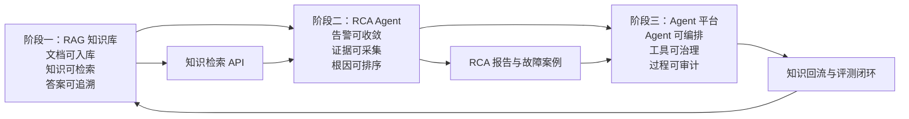
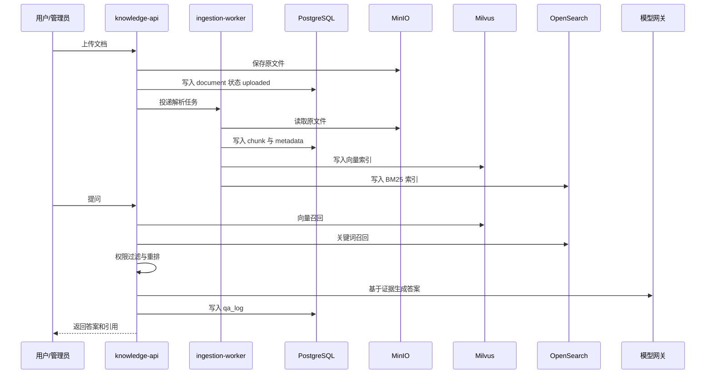
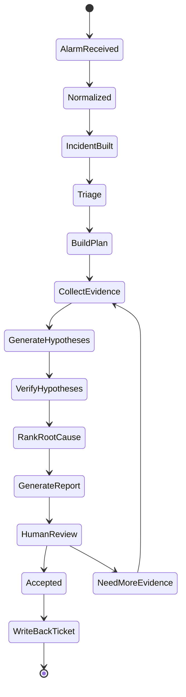
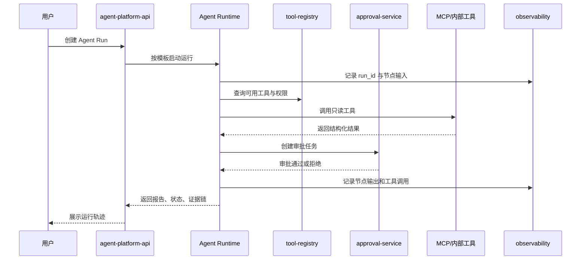

# AI Agent 电信运维三项目开发实施计划

生成日期：2026-06-17  
适用范围：指导本仓库后续从文档材料进入可运行 MVP 开发  
主线目标：先建设 RAG 知识底座，再建设基站告警 RCA Agent，最终沉淀为智能运维 Agent 平台

## 1. 开发总览

本计划是三份设计规格的工程实施主控文档：

- [项目一：基于 RAG 的内部知识库智能问答系统](project-1-rag-knowledge-base-design-spec.md)
- [项目二：基站告警根因分析 Agent](project-2-base-station-alarm-rca-agent-design-spec.md)
- [项目三：智能运维 Agent 平台](project-3-intelligent-ops-agent-platform-design-spec.md)

三项目不是并行孤岛，而是能力递进关系：



### 1.1 MVP 目标

MVP 目标是形成一套可以本地运行、可以演示、可以继续扩展的工程骨架：

- 能导入样例运维文档，完成带引用的知识问答。
- 能基于模拟或回放告警生成 RCA 证据链和 Top-N 根因候选。
- 能用统一门户查看知识问答、RCA 报告、Agent 运行记录和审批任务。
- 能通过评测脚本输出 RAG 检索命中、RCA 历史回放、工具调用成功率等可验证指标。

### 1.2 非目标

- MVP 不自动执行重启、割接、参数变更等高风险生产动作。
- MVP 不承诺单次输出就是最终根因，RCA 结论必须支持人工确认。
- MVP 不替代现有监控、网管、工单、CMDB 和自动化平台，只通过工具接口增强它们。
- MVP 不以自由对话式 Agent 作为核心诊断方式，RCA 和平台执行都采用受控流程、结构化工具和审计记录。

### 1.3 默认技术栈

| 类别 | MVP 默认选型 | 说明 |
|---|---|---|
| 后端 | Python 3.10+、FastAPI、Pydantic | API 服务、工具服务、Agent 服务统一语言栈 |
| ORM 与迁移 | SQLAlchemy、Alembic | 管理 PostgreSQL 表结构演进 |
| 异步任务 | Celery + Redis | 文档解析、OCR、向量化、索引构建、离线评测 |
| 数据库 | PostgreSQL | 元数据、运行记录、审批、报告、反馈 |
| 向量检索 | Milvus 2.x | 文档 chunk 和案例向量召回 |
| 关键词检索 | OpenSearch 或 Elasticsearch | BM25、告警码、日志类检索 |
| 模型调用 | OpenAI-compatible API 抽象 | 支持企业内网模型、Qwen 系列或其他兼容网关 |
| RAG 模型 | BGE-M3、bge-reranker-v2-m3 或同类模型 | embedding 与二阶段重排候选 |
| RCA 编排 | LangGraph 0.x 或自研 DAG | 放在 2025.10 前的 RCA 阶段，保持时间线可信 |
| 平台编排 | LangGraph v1 | 仅用于 2025.10 后的平台化阶段 |
| 工具协议 | MCP/FastMCP | 仅用于平台化阶段的工具治理与统一注册 |
| 前端 | React、Ant Design、ECharts | 问答、报告、运行轨迹、审批与指标看板 |
| 可观测 | OpenTelemetry、Prometheus、Grafana | 服务指标、Agent trace、工具调用日志 |
| 本地环境 | Docker Compose | PostgreSQL、Redis、Milvus、OpenSearch 等依赖 |

## 2. 推荐仓库结构

后续进入代码开发时，建议将当前文档仓库扩展为 monorepo：

```text
AI_Employee/
├─ Docs/
├─ apps/
│  └─ web-portal/
├─ services/
│  ├─ knowledge-api/
│  ├─ ingestion-worker/
│  ├─ rca-agent/
│  ├─ agent-platform-api/
│  ├─ tool-registry/
│  └─ eval-service/
├─ packages/
│  ├─ common-schemas/
│  ├─ llm-gateway/
│  ├─ auth-policy/
│  └─ observability/
├─ infra/
│  ├─ docker-compose/
│  ├─ k8s/
│  └─ helm/
├─ tests/
│  ├─ rag-eval/
│  ├─ rca-replay/
│  └─ platform-e2e/
└─ scripts/
```

### 2.1 服务边界

| 模块 | 职责 | 首次落地阶段 |
|---|---|---|
| `services/knowledge-api` | 知识问答 API、混合检索、引用校验、反馈记录 | 阶段一 |
| `services/ingestion-worker` | 文档解析、清洗、分段、向量化、索引构建 | 阶段一 |
| `services/rca-agent` | 告警标准化、incident 聚合、RCA 状态机、证据池、报告生成 | 阶段二 |
| `services/agent-platform-api` | Agent Run、模板、审批、审计、运行轨迹查询 | 阶段三 |
| `services/tool-registry` | 工具注册、Schema、鉴权、风险等级、健康检查 | 阶段三 |
| `services/eval-service` | RAG 离线评测、RCA 回放、平台版本对比 | 阶段一启动，阶段三完善 |
| `apps/web-portal` | 知识问答、RCA 报告、Agent 运行记录、审批任务、指标看板 | 阶段一启动，阶段三完善 |
| `packages/common-schemas` | 共享 Pydantic 与 TypeScript 类型定义 | M0 |
| `packages/llm-gateway` | 模型调用、重试、结构化输出、提示词版本管理 | 阶段一 |
| `packages/auth-policy` | RBAC、资源权限、工具风险策略 | 阶段一简化，阶段三完善 |
| `packages/observability` | Trace、日志字段、指标埋点公共封装 | 阶段二启动，阶段三完善 |

### 2.2 本地依赖

本地开发环境以 Docker Compose 拉起依赖：

- PostgreSQL：业务元数据、运行记录、审批与反馈。
- Redis：Celery broker、缓存、短期任务状态。
- Milvus：向量召回。
- OpenSearch 或 Elasticsearch：BM25 与日志检索。
- MinIO：文档原文件与解析产物对象存储。
- Prometheus/Grafana：开发期基础观测。

MVP 首次开发可以用少量样例文档和模拟告警数据启动，不依赖真实生产系统。

## 3. 阶段一：RAG 知识库 MVP

阶段目标：把基站运维文档转成可检索、可引用、可评测的知识服务，为后续 RCA Agent 提供稳定知识工具。

### 3.1 模块拆分

| 模块 | 输入 | 输出 | 关键行为 |
|---|---|---|---|
| 文档接入 | PDF、Word、Excel、Markdown、HTML、扫描件 | document 记录、原文件 URI | 上传、批量导入、状态机、版本与权限标签 |
| 文档解析 | document 记录、原文件 | 结构化段落、表格、页码、标题层级 | OCR 兜底、表格保持、乱码检查、解析失败重试 |
| 分段索引 | 结构化文本 | chunk、embedding、BM25 索引 | 标题层级切分、告警码保护、metadata 与 ACL 继承 |
| 混合检索 | query、用户权限、知识范围 | evidence pack | 向量召回、BM25 召回、元数据过滤、重排、去重 |
| 问答生成 | evidence pack、用户问题、会话上下文 | answer、citations、confidence、trace_id | 证据约束、引用校验、低置信拒答、日志留存 |
| 反馈评测 | 用户反馈、黄金问答集 | 质量报表 | Top-K 命中、引用覆盖、拒答准确、延迟统计 |

### 3.2 核心数据流



### 3.3 API 边界

| 方法 | 路径 | 用途 | MVP 响应要求 |
|---|---|---|---|
| `POST` | `/api/v1/documents` | 上传文档并触发解析 | 返回 `doc_id`、`parse_status`、`trace_id` |
| `GET` | `/api/v1/documents/{doc_id}` | 查询文档解析与发布状态 | 返回版本、状态、chunk 数、失败原因 |
| `POST` | `/api/v1/documents/{doc_id}/publish` | 发布已审核文档 | 发布后才进入默认检索范围 |
| `POST` | `/api/v1/chat/query` | 知识问答 | 返回答案、引用、置信度、trace_id |
| `POST` | `/api/v1/feedback` | 用户反馈 | 记录有用、无用、引用错误、过期等反馈 |

### 3.4 验收场景

- 导入至少三类样例知识源：SOP 文档、告警字典、历史工单摘要。
- 输入告警处理类问题，返回带 `chunk_id`、文档标题、页码或章节路径的引用。
- 用户无权限访问的文档不进入召回结果，也不出现在答案引用中。
- 离线评测脚本可以输出检索 Top-5 命中率、引用覆盖率、平均响应耗时。
- 模型或向量库不可用时，服务返回可解释错误或降级摘要，不生成无证据答案。

## 4. 阶段二：基站告警 RCA Agent MVP

阶段目标：在 RAG 知识服务基础上，把告警、KPI、日志、拓扑、历史工单组织成可审计的 RCA 分析流程。

### 4.1 模块拆分

| 模块 | 输入 | 输出 | 关键行为 |
|---|---|---|---|
| 告警标准化 | 原始告警 payload | alarm_event | 厂家字段映射、告警码归一、fingerprint、严重级别 |
| Incident 构建 | alarm_event 流 | incident | 时间窗口聚合、同站点聚合、同链路聚合、主从告警标注 |
| 上下文采集 | incident | evidence | 查询 KPI、日志、拓扑、知识库、历史工单 |
| RCA Runtime | incident_id、运行参数 | rca_run | Triage、Plan、Collect、Reason、Verify、Report 状态流 |
| 根因排序 | evidence pool、候选假设 | hypotheses | 规则分数 + 模型解释，输出 Top-N 根因候选 |
| 报告生成 | hypotheses、evidence | Markdown 报告 | 事件摘要、影响范围、证据链、建议动作、待确认项 |
| 人工确认 | report_id、审核意见 | review 结果 | 采纳、拒绝、补充证据、最终根因记录 |

### 4.2 RCA 状态流



RCA 阶段使用 LangGraph 0.x 或自研 DAG 状态机，不引入平台化阶段的 MCP 工具治理。工具输入输出使用 Pydantic/JSON Schema 固定结构，避免模型自由拼接参数。

### 4.3 工具接口

| 工具 | 输入 | 输出 | MVP 实现方式 |
|---|---|---|---|
| KPI 查询 | site_id、cell_id、time_window、metric_names | 指标序列、异常点、缺失说明 | 先用模拟时序数据，后续接 Prometheus/InfluxDB |
| 日志检索 | ne_id、time_window、keywords | 日志片段、错误码、来源 | 先用样例日志索引，后续接 OpenSearch |
| 拓扑查询 | site_id、ne_id、link_id | 上下游关系、影响对象、更新时间 | 先用静态拓扑样例，后续接 Neo4j/CMDB |
| 知识库检索 | alarm_code、symptom、query | SOP、告警解释、处理步骤 | 调用阶段一 `/api/v1/chat/query` 或检索内部接口 |
| 工单查询 | site、vendor、symptom | 相似案例、闭环状态、质量分 | 先用样例工单库，后续接企业工单系统 |

### 4.4 API 边界

| 方法 | 路径 | 用途 | MVP 响应要求 |
|---|---|---|---|
| `POST` | `/api/v1/alarms/events` | 接收或回放原始告警 | 返回标准化状态和 alarm_event_id |
| `POST` | `/api/v1/incidents/build` | 从告警集合构建 incident | 返回 incident_id、主告警、伴随告警数量 |
| `POST` | `/api/v1/rca/runs` | 创建 RCA 分析 | 返回 run_id、初始状态、trace_id |
| `GET` | `/api/v1/rca/runs/{run_id}` | 查询运行状态 | 返回当前节点、证据数量、候选根因、错误信息 |
| `GET` | `/api/v1/rca/reports/{report_id}` | 查看 RCA 报告 | 返回 Markdown、hypotheses、evidence 引用 |
| `POST` | `/api/v1/rca/reports/{report_id}/review` | 人工确认报告 | 返回审核状态和最终根因 |
| `POST` | `/api/v1/tickets/{ticket_id}/rca-summary` | 工单回写 | MVP 可先写入模拟工单记录 |

### 4.5 验收场景

- 使用模拟告警流生成 incident，并展示告警收敛数量和主告警。
- 对一个 incident 自动采集 KPI、日志、拓扑、知识库和历史工单证据。
- 生成 RCA Markdown 报告，报告中的每个根因候选都绑定 evidence_id。
- 工具超时或数据缺失时，报告明确标注待确认信息，不把缺失数据解释为确定结论。
- 历史回放评测可以输出 Top-1/Top-3 根因覆盖、证据覆盖、报告生成耗时、人工采纳率。

## 5. 阶段三：智能运维 Agent 平台 MVP

阶段目标：把前两个阶段沉淀出的 Agent 编排、工具调用、人机审批、审计、评测能力平台化，支撑更多运维场景。

### 5.1 平台模块

| 模块 | 职责 | MVP 边界 |
|---|---|---|
| Agent Runtime | 管理 Agent Run、状态持久化、断点恢复、节点日志 | 支持知识问答、RCA、巡检三类模板 |
| 工具注册中心 | 管理工具 Schema、MCP Server、风险等级、权限、健康检查 | 平台阶段引入 MCP/FastMCP |
| 人机协同 | 审批、拒绝、补充信息、超时升级 | 高风险动作和 RCA 正式回写必须审批 |
| 模板管理 | Agent 图、Prompt、可用工具、输出报告模板 | 支持版本、发布、禁用 |
| 可观测 | run trace、tool call log、模型调用、审批记录 | 支持按 run_id 查询完整链路 |
| 评测中心 | 历史 run 回放、标准任务集、版本对比 | 复用 RAG 评测和 RCA 回放数据 |
| 知识回流 | 将确认后的报告和工单结论进入候选知识池 | 未审核内容不进入正式知识库 |

### 5.2 平台数据流



### 5.3 Agent 模板

| 模板 | 输入 | 输出 | 复用能力 |
|---|---|---|---|
| 知识问答 Agent | 自然语言问题、知识范围 | 答案、引用、置信度 | RAG 检索、引用校验、反馈 |
| RCA Agent | incident_id 或告警集合 | 根因候选、证据链、报告 | 工具调用、证据池、人审 |
| 巡检 Agent | 巡检对象、巡检项、时间窗口 | 异常摘要、检查结果、建议 | 工具注册、只读查询、报告模板 |

后续可扩展变更评估 Agent、工单总结 Agent、故障复盘 Agent。MVP 首批只要求三类模板打通。

### 5.4 API 边界

| 方法 | 路径 | 用途 | MVP 响应要求 |
|---|---|---|---|
| `POST` | `/api/v1/agent-runs` | 创建 Agent Run | 返回 run_id、agent_name、status、trace_id |
| `GET` | `/api/v1/agent-runs/{run_id}` | 查询运行状态 | 返回节点轨迹、工具调用、审批状态、输出报告 |
| `POST` | `/api/v1/tools` | 注册工具 | 返回 tool_name、risk_level、status |
| `GET` | `/api/v1/tools` | 查询工具列表 | 支持按风险等级、状态、所属服务过滤 |
| `POST` | `/api/v1/approval-tasks/{task_id}/decision` | 处理审批任务 | 返回审批结果并恢复或终止 Agent Run |
| `POST` | `/api/v1/evaluations/runs` | 发起评测回放 | 返回 eval_run_id 和任务状态 |

### 5.5 验收场景

- 通过统一门户创建知识问答、RCA、巡检三类 Agent Run。
- 工具注册中心能展示工具 Schema、风险等级、健康状态和调用记录。
- 只读工具可自动调用；高风险动作只生成审批任务，不直接执行。
- 可以按 run_id 查看用户输入、模型输出、工具调用、证据链、审批记录和最终报告。
- 评测中心可以选择历史 run 或标准任务集进行版本对比。

## 6. 开发里程碑

| 里程碑 | 目标 | 主要交付 | 验收方式 |
|---|---|---|---|
| M0：工程骨架 | 建立 monorepo 与本地开发环境 | 目录结构、Docker Compose、基础 CI、共享 schema | 本地依赖可启动，服务健康检查可访问 |
| M1：RAG 闭环 | 文档入库到带引用问答 | knowledge-api、ingestion-worker、web 问答页 | 导入样例文档并返回引用答案 |
| M2：RAG 稳定性 | 评测、权限、审计、降级 | rag-eval、ACL、qa_log、feedback | 输出离线评测报表和审计记录 |
| M3：RCA 原型 | 告警收敛与证据采集 | rca-agent、模拟告警、工具适配器 | incident 可生成证据池 |
| M4：RCA 验收 | 根因候选、报告、人审、回放 | RCA 报告、review API、rca-replay | 历史回放输出 Top-N 指标和报告耗时 |
| M5：平台核心 | Runtime、工具注册、审批、门户 | agent-platform-api、tool-registry、web 门户 | 三类 Agent Run 可查询运行轨迹 |
| M6：平台闭环 | 模板复用、评测中心、知识回流 | 模板库、eval-service、候选知识池 | 确认后的报告可进入候选知识审核流 |

### 6.1 推荐迭代顺序

1. 先完成 M0，避免各服务独立堆叠导致接口和依赖失控。
2. M1 与 M2 形成知识底座，RCA 不绕过 RAG 直接访问文档。
3. M3 先使用模拟数据打通状态机，再接真实系统适配器。
4. M4 固化 RCA 报告和评测口径，再进入平台化。
5. M5 和 M6 只抽象已经被 RAG/RCA 验证过的共性能力。

## 7. 测试与评测计划

### 7.1 文档与静态检查

- Markdown 标题层级连续，链接到三份设计规格可读。
- Mermaid 图块可以被常见 Markdown 渲染器识别。
- 文档中不保留占位语、空章节或无法执行的泛化描述。
- 技术时间线保持一致：RCA 阶段不写 LangGraph v1；MCP/FastMCP 只落在平台阶段。

### 7.2 RAG 测试

| 测试类型 | 场景 | 通过标准 |
|---|---|---|
| 单元测试 | 文档状态机、chunk metadata、ACL 过滤、引用校验 | 状态转换合法，越权 chunk 不返回 |
| 集成测试 | 上传文档、解析、索引、问答 | 返回答案、引用、trace_id |
| 离线评测 | 黄金问答集 Top-K 召回 | 输出可复现评测报表 |
| 降级测试 | Milvus 或模型服务不可用 | 返回可解释降级结果 |

### 7.3 RCA 测试

| 测试类型 | 场景 | 通过标准 |
|---|---|---|
| 单元测试 | 告警标准化、fingerprint、incident 聚合 | 相同故障告警可归并 |
| 工具测试 | KPI、日志、拓扑、知识库、工单工具 | 输入输出符合 Schema |
| 回放测试 | 历史故障样例 | 生成 Top-N 候选和证据链 |
| 安全测试 | 高风险处置建议 | 只输出建议和审批需求，不直接执行 |

### 7.4 平台测试

| 测试类型 | 场景 | 通过标准 |
|---|---|---|
| 运行测试 | 创建三类 Agent Run | 状态可持久化，轨迹可查询 |
| 工具治理 | 注册工具、禁用工具、健康检查 | 风险等级和权限生效 |
| 审批测试 | 创建、通过、拒绝审批任务 | Agent Run 可恢复或终止 |
| 评测测试 | 历史 run 回放 | 输出版本对比结果 |

## 8. 风险与应对

| 风险 | 影响 | 应对策略 |
|---|---|---|
| 文档解析质量不稳定 | chunk 质量差，影响检索 | 结构化解析、OCR 兜底、解析质量检查、人工修复入口 |
| 纯向量检索漏召回告警码 | 用户查不到关键知识 | 向量召回 + BM25 + 术语词典 + 重排 |
| 模型生成无证据结论 | 影响可信度 | 答案和根因都必须绑定引用或 evidence_id |
| Agent 工具调用发散 | 成本高且结果不可控 | 状态机流程、最大工具调用次数、结构化计划 |
| 工具权限不统一 | 审计和安全风险 | 平台阶段统一工具注册、风险等级、审批策略 |
| 评测数据不足 | 无法证明迭代效果 | 从高频问题、历史工单、人工复盘中构建样例集 |
| 生产系统暂不可接入 | MVP 联调受阻 | 先用模拟数据和适配器接口，真实系统作为后续替换 |

## 9. 后续开发拆分原则

- 每个里程碑必须能独立运行和验收，不把关键能力推迟到最后集成。
- 所有跨服务数据结构优先放入 `packages/common-schemas`，避免 API 与前端各自定义。
- 所有模型输出进入业务流程前必须经过结构化校验。
- 所有工具调用必须记录输入摘要、输出摘要、耗时、状态、错误码和 trace_id。
- 所有报告中的关键结论必须绑定引用来源或 evidence_id。
- 高风险动作在 MVP 中只允许生成建议和审批任务，不直接执行。

## 10. 完成定义

当以下条件满足时，三项目 MVP 可认为达到开发实施计划的首轮目标：

- RAG 知识库能完成样例文档入库、混合检索、带引用问答和离线评测。
- RCA Agent 能从模拟或回放告警生成 incident、证据池、Top-N 根因候选和 Markdown 报告。
- Agent 平台能统一创建和查询至少三类 Agent Run，并展示工具调用、审批和运行轨迹。
- 评测脚本能输出 RAG、RCA、平台三个层面的可复现指标。
- 文档、接口、数据模型和测试命令足以支撑下一轮工程任务拆分。

