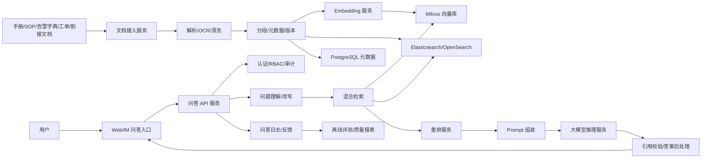

# 软件设计说明书：基于 RAG 的内部知识库智能问答系统

项目周期：2024.06 - 2025.01  
项目定位：基站运维知识底座  
目标用户：一线运维工程师、网优工程师、NOC 值班人员、专家组、知识管理员

## 1. 项目背景

基站运维场景中，知识分散在设备手册、告警字典、历史工单、SOP、割接方案、巡检记录和专家经验中。传统检索系统主要依赖关键词匹配，面对告警码、设备型号、厂家术语、口语化问题时命中不稳定。一线工程师需要在多个系统之间切换，人工查找处理步骤和历史案例，效率低且容易遗漏适用条件。

本项目通过 RAG 架构建设内部知识库智能问答系统，使用户能够用自然语言提问，并获得带来源引用的答案。系统不追求让模型自由生成“看似合理”的答案，而是强调检索证据、引用溯源、权限隔离、知识版本和可评测。

## 2. 建设目标

功能目标：

- 支持多类型基站运维文档接入，包括 PDF、Word、Excel、HTML、Markdown、扫描件 OCR。
- 支持文档解析、清洗、分段、向量化、索引构建和版本管理。
- 支持基于向量检索、BM25、元数据过滤和重排的混合检索。
- 支持自然语言问答、引用溯源、原文定位、多轮追问和用户反馈。
- 支持知识权限控制、操作审计、知识审核和过期下线。
- 支持问答 API，供后续 RCA Agent 调用。

非目标：

- 不在第一阶段自动执行运维动作。
- 不替代专家审核流程。
- 不承诺对无知识来源的问题给出确定性答案。

## 3. 总体架构



## 4. 技术栈

后端：

- Python 3.10+
- FastAPI
- Celery + Redis，或企业内部异步任务框架
- PostgreSQL
- MinIO/NAS/对象存储

检索与知识库：

- Milvus 2.x：向量检索
- Elasticsearch/OpenSearch：BM25、关键词、告警码和日志类检索
- BGE-M3：中文和多语言 Embedding
- bge-reranker-v2-m3 或同类 reranker：二阶段重排

模型与推理：

- Qwen2/Qwen2.5/企业内训模型
- vLLM/TGI/企业模型网关
- OpenAI-compatible API 作为模型调用抽象

前端与可观测：

- React/Vue + Ant Design
- Prometheus + Grafana
- OpenTelemetry
- RAGAS 或自建 RAG 评测脚本

## 5. 核心模块设计

### 5.1 文档接入服务

职责：

- 提供文档上传、批量导入、目录同步和定时同步能力。
- 记录知识源、文档版本、上传人、审核状态、权限标签和生效时间。
- 触发异步解析任务。

关键设计：

- 文档状态机：uploaded、parsing、parse_failed、pending_review、published、archived。
- 支持同一文档多版本共存，检索时默认使用最新已发布版本。
- 支持知识源级别和文档级别的权限继承。

### 5.2 文档解析与清洗服务

职责：

- 解析 PDF、Word、Excel、HTML、Markdown。
- 对扫描件进行 OCR。
- 保留标题层级、表格结构、图片说明和页码信息。
- 清洗乱码、重复页眉页脚、无效空行、目录页噪声。

关键设计：

- 表格不直接拍平成长文本，优先按行列语义生成结构化片段。
- 告警码、参数名、设备型号作为特殊 token 保护，避免切分破坏。
- 每个片段保存 source_page、section_path、table_id、row_id 等来源信息。

### 5.3 分段与索引服务

职责：

- 将解析后的文档转换为 chunk。
- 生成 chunk metadata。
- 调用 Embedding 服务生成向量。
- 写入 Milvus 和 Elasticsearch/OpenSearch。

分段策略：

- 一级策略：按标题层级切分。
- 二级策略：按语义段落和处理步骤切分。
- 三级策略：超过阈值时滑动窗口切分。
- 特殊策略：告警码说明、SOP 步骤、表格记录保持完整。

推荐字段：

| 字段 | 说明 |
|---|---|
| chunk_id | 分段唯一 ID |
| doc_id | 文档 ID |
| source_id | 知识源 ID |
| content | 分段正文 |
| section_path | 标题路径 |
| page_no | 页码 |
| vendor | 厂家 |
| device_type | 设备类型 |
| network_type | 4G/5G/传输等 |
| effective_time | 生效时间 |
| acl_tags | 权限标签 |
| version | 文档版本 |

### 5.4 混合检索服务

职责：

- 接收用户问题和权限上下文。
- 进行问题改写和术语归一化。
- 并行执行向量召回、BM25 召回和元数据过滤。
- 合并、去重并交给 reranker 排序。

检索流程：

1. Query Normalize：识别告警码、厂家、网元、小区、设备型号。
2. Query Rewrite：将口语化问题改写为标准检索表达。
3. Dense Recall：Milvus Top-K 向量召回。
4. Sparse Recall：Elasticsearch/OpenSearch BM25 召回。
5. Metadata Filter：按权限、专业线、厂家、版本过滤。
6. Rerank：使用 reranker 对候选片段排序。
7. Evidence Pack：输出可引用证据包。

### 5.5 问答生成服务

职责：

- 将证据包、用户问题、系统约束组装成 Prompt。
- 调用大模型生成答案。
- 校验答案引用。
- 对无证据或低置信问题执行拒答。

Prompt 约束：

- 答案必须基于给定证据。
- 每个关键结论必须带引用编号。
- 如果证据不足，说明缺少哪些信息，不得编造。
- 对高风险操作给出“需人工确认”提示。

### 5.6 反馈与评测服务

职责：

- 收集用户反馈。
- 支持专家标注黄金问答。
- 统计检索命中率、引用覆盖率、拒答准确率、答案满意度。
- 支持版本间 A/B 评测。

推荐指标：

| 指标 | 含义 |
|---|---|
| Retrieval Top-5 Hit Rate | 标准答案证据是否出现在 Top-5 |
| Citation Coverage | 答案关键结论是否有引用 |
| Faithfulness | 答案是否被证据支持 |
| Answer Relevance | 答案是否解决问题 |
| Refusal Accuracy | 无知识问题是否正确拒答 |
| P95 Latency | 端到端响应耗时 |

## 6. 数据库设计

### 6.1 knowledge_source

| 字段 | 类型 | 说明 |
|---|---|---|
| id | bigint | 主键 |
| name | varchar | 知识源名称 |
| type | varchar | manual/sop/ticket/web/excel |
| owner_dept | varchar | 归属部门 |
| acl_policy | jsonb | 权限策略 |
| status | varchar | active/disabled |
| created_at | timestamp | 创建时间 |

### 6.2 document

| 字段 | 类型 | 说明 |
|---|---|---|
| id | bigint | 主键 |
| source_id | bigint | 知识源 ID |
| title | varchar | 文档标题 |
| file_uri | varchar | 文件地址 |
| version | varchar | 文档版本 |
| parse_status | varchar | 解析状态 |
| review_status | varchar | 审核状态 |
| effective_from | timestamp | 生效时间 |
| effective_to | timestamp | 失效时间 |
| metadata | jsonb | 厂家、型号、专业线等 |

### 6.3 document_chunk

| 字段 | 类型 | 说明 |
|---|---|---|
| id | bigint | 主键 |
| doc_id | bigint | 文档 ID |
| chunk_no | int | 分段序号 |
| content | text | 分段内容 |
| content_hash | varchar | 去重 hash |
| section_path | varchar | 标题路径 |
| page_no | int | 页码 |
| metadata | jsonb | 元数据 |
| acl_tags | jsonb | 权限标签 |
| vector_id | varchar | Milvus 向量 ID |

### 6.4 qa_log

| 字段 | 类型 | 说明 |
|---|---|---|
| id | bigint | 主键 |
| user_id | varchar | 用户 |
| question | text | 原始问题 |
| rewritten_query | text | 改写问题 |
| retrieved_chunks | jsonb | 命中片段 |
| answer | text | 模型答案 |
| model_name | varchar | 模型名称 |
| prompt_version | varchar | Prompt 版本 |
| latency_ms | int | 耗时 |
| created_at | timestamp | 创建时间 |

### 6.5 feedback

| 字段 | 类型 | 说明 |
|---|---|---|
| id | bigint | 主键 |
| qa_log_id | bigint | 问答日志 ID |
| user_id | varchar | 反馈人 |
| feedback_type | varchar | useful/useless/wrong_citation/outdated |
| comment | text | 备注 |
| expert_label | jsonb | 专家标注 |

## 7. 接口设计

### 7.1 提问接口

POST `/api/v1/chat/query`

请求：

```json
{
  "session_id": "s_001",
  "question": "某 5G 小区出现 RRC 建立失败率升高，应该先查什么？",
  "knowledge_scopes": ["wireless", "5g"],
  "stream": true
}
```

响应：

```json
{
  "answer": "建议先检查告警、无线侧 KPI、传输链路状态和近期参数变更。依据如下...",
  "citations": [
    {
      "chunk_id": "c_1001",
      "doc_title": "5G 小区接入问题处理 SOP",
      "page_no": 12,
      "section_path": "接入失败 > RRC 建立失败"
    }
  ],
  "confidence": 0.78,
  "trace_id": "run_001"
}
```

### 7.2 文档上传接口

POST `/api/v1/documents`

### 7.3 文档发布接口

POST `/api/v1/documents/{doc_id}/publish`

### 7.4 反馈接口

POST `/api/v1/feedback`

## 8. 权限与安全设计

- 登录接入企业 SSO。
- 用户权限由部门、专业线、区域、岗位共同决定。
- 检索阶段按 chunk acl_tags 过滤。
- 答案生成阶段再次校验引用片段权限。
- 问答日志做敏感字段脱敏。
- 支持审计查询：谁在什么时间查询了什么知识，返回了哪些引用。

## 9. 部署设计

推荐部署形态：

- API 服务：Kubernetes Deployment，多副本。
- 文档处理 Worker：Kubernetes Job/Deployment，按队列扩缩容。
- Milvus：独立集群或托管向量库。
- Elasticsearch/OpenSearch：复用企业日志检索集群或独立部署。
- PostgreSQL：主从或企业数据库服务。
- Redis：缓存和任务队列。
- 模型服务：内网 vLLM/TGI 或企业模型网关。

## 10. 关键问题与解决方案

| 问题 | 影响 | 解决方案 |
|---|---|---|
| PDF/表格解析不稳定 | 检索片段质量差 | 引入结构化解析、OCR 兜底、表格保持 |
| 告警码召回差 | 用户查不到关键知识 | 混合检索 + 术语词典 |
| 模型幻觉 | 答案不可信 | 强制引用、证据校验、低置信拒答 |
| 权限复杂 | 敏感知识泄漏 | chunk 级 ACL + 二次引用校验 |
| 知识过期 | 旧 SOP 误导操作 | 版本管理、过期下线、专家审核 |
| 延迟过高 | 用户体验差 | 缓存、Top-K 调优、异步流式输出 |

## 11. 验收标准

- 支持核心知识源接入和增量更新。
- 用户能在 Web 或 IM 入口完成自然语言问答。
- 答案包含来源引用，并能跳转到原文。
- 权限过滤有效，不返回越权文档。
- 离线评测集可重复运行，并输出版本对比结果。
- 系统具备基础可观测和错误告警能力。

