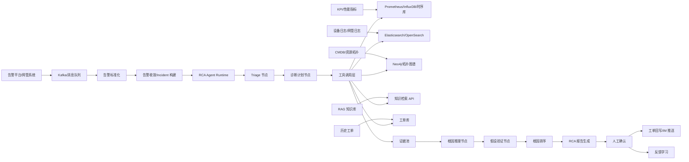
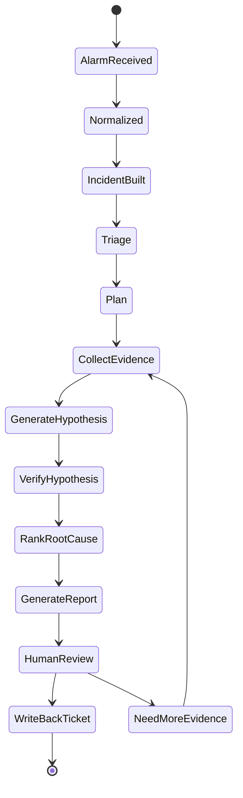

# 软件设计说明书：基站告警根因分析 Agent

项目周期：2025.02 - 2025.09  
项目定位：面向基站告警的 RCA 场景 Agent  
目标用户：NOC 值班人员、一线运维工程师、无线/传输专家、工单处理人员

## 1. 项目背景

基站故障通常不会只产生单条告警，而是伴随多个网元、多个小区、多条链路和多个指标的异常。传统告警系统擅长发现异常，但不擅长解释“为什么发生”和“下一步查什么”。一线人员需要在告警平台、指标平台、日志平台、拓扑系统、知识库和工单系统之间反复切换，人工整理证据后判断根因。

本项目在第一阶段 RAG 知识库基础上建设基站告警根因分析 Agent。Agent 不直接替代专家，而是把告警理解、上下文采集、证据组织、根因候选排序和 RCA 报告生成做成可控流程，帮助缩短初步诊断时间。

## 2. 建设目标

功能目标：

- 接入基站告警流，将原始告警标准化为统一事件模型。
- 对同站点、同链路、同时间窗口的告警进行去重和收敛。
- 自动采集 RCA 所需上下文，包括 KPI、日志、拓扑、历史工单和知识库 SOP。
- 通过受控 Agent 流程生成根因候选、证据链、置信度和处置建议。
- 支持人工确认、工单回写和反馈闭环。
- 支持历史故障回放评测。

非目标：

- 不在本阶段默认自动执行高风险处置动作。
- 不承诺单次输出就是最终根因。
- 不替代现有告警平台和工单系统，而是作为诊断增强层。

## 3. 总体架构



## 4. 技术栈

后端与任务处理：

- Python 3.10+
- FastAPI
- Kafka 或企业消息队列
- Celery/Temporal/企业工作流引擎
- PostgreSQL
- Redis

Agent 与模型：

- LangGraph 0.x 或自研 DAG 状态机
- Tool Calling + JSON Schema/Pydantic
- Qwen2.5/企业内训模型/兼容 OpenAI API 的内网模型服务
- RAG 知识库检索 API

数据与检索：

- Prometheus/InfluxDB/企业时序库：KPI 查询
- Elasticsearch/OpenSearch：日志检索
- Neo4j 或图数据库：基站、小区、传输链路、上游设备拓扑
- PostgreSQL：incident、证据、报告、反馈

可观测：

- OpenTelemetry
- Prometheus + Grafana
- Agent run trace 和 tool call log

## 5. 核心业务流程



流程说明：

1. 告警接入：从告警平台获取原始告警。
2. 标准化：统一字段、厂家术语、告警等级和站点标识。
3. Incident 构建：按站点、链路、时间窗口和拓扑关系聚合告警。
4. Triage：识别故障类型，例如无线接入、传输中断、时钟异常、设备退服。
5. Plan：生成证据采集计划。
6. Collect：调用工具采集 KPI、日志、拓扑、知识和工单。
7. Hypothesis：生成根因候选。
8. Verify：针对每个候选补充反证和支持证据。
9. Rank：输出 Top-N 根因及置信度。
10. Report：生成 RCA 报告。
11. Human Review：人工确认或要求补充证据。
12. Write Back：写回工单、推送 IM、沉淀案例。

## 6. 核心模块设计

### 6.1 告警标准化模块

职责：

- 将不同厂家、不同系统的告警映射为统一 alarm_event。
- 识别站点、小区、网元、端口、链路、告警码、告警等级、开始时间和恢复时间。
- 生成告警 fingerprint，用于去重。

标准字段：

| 字段 | 说明 |
|---|---|
| alarm_id | 原始告警 ID |
| alarm_code | 告警码 |
| alarm_name | 告警名称 |
| vendor | 厂家 |
| site_id | 站点 ID |
| cell_id | 小区 ID |
| ne_id | 网元 ID |
| severity | 告警等级 |
| start_time | 发生时间 |
| clear_time | 恢复时间 |
| raw_payload | 原始告警 |

### 6.2 告警收敛模块

职责：

- 对重复告警、衍生告警、短时抖动告警进行归并。
- 将多个 alarm_event 聚合成 incident。
- 标注主告警、伴随告警和下游影响告警。

收敛策略：

- 时间窗口：告警前后 10 - 30 分钟内聚合。
- 空间范围：同站点、同小区、同传输链路、同上游设备。
- 拓扑关系：上游设备故障导致下游多个小区告警时，聚合为同一 incident。
- 告警规则：基于专家规则识别父子告警。

### 6.3 上下文采集模块

职责：

- 根据 incident 自动采集诊断上下文。
- 调用各类工具并将结果转为证据。

工具清单：

| 工具 | 输入 | 输出 |
|---|---|---|
| KPI 查询工具 | site_id/cell_id/time_window/metric_names | 指标序列、异常点 |
| 日志检索工具 | ne_id/time_window/keywords | 日志片段、错误码 |
| 拓扑查询工具 | site_id/ne_id/link_id | 上下游关系、影响范围 |
| 知识库检索工具 | alarm_code/symptom/query | SOP、告警解释、处理步骤 |
| 工单查询工具 | site/vendor/symptom | 相似历史案例 |

### 6.4 RCA Agent Runtime

职责：

- 管理一次 RCA run 的状态。
- 控制节点执行顺序。
- 管理工具调用、重试、超时和异常。
- 保存中间证据和推理结果。

设计原则：

- 采用受控状态机，而不是完全开放式 ReAct。
- 所有工具输入输出必须结构化。
- 所有根因判断必须引用 evidence_id。
- 高风险建议必须进入人工确认。

### 6.5 根因推理模块

职责：

- 基于证据池生成根因候选。
- 对每个候选给出支持证据和反证。
- 按规则分数和模型判断进行排序。

根因候选结构：

```json
{
  "hypothesis_id": "h_001",
  "root_cause_type": "transmission_link_degradation",
  "description": "传输链路质量下降导致小区接入失败率升高",
  "supporting_evidence_ids": ["e_001", "e_003"],
  "contradicting_evidence_ids": ["e_007"],
  "confidence": 0.72,
  "next_check": ["确认传输端口误码", "核对近期割接记录"]
}
```

排序因子：

- 告警时间相关性。
- 拓扑距离。
- KPI 异常强度。
- 历史案例相似度。
- SOP 规则命中。
- 反证数量。
- 数据来源可信度。

### 6.6 RCA 报告模块

报告结构：

- 事件摘要。
- 影响范围。
- 关键时间线。
- 主告警和伴随告警。
- 证据链。
- Top-N 根因候选。
- 推荐处置动作。
- 风险提示。
- 需人工确认的信息。
- 引用来源。

报告要求：

- 每个根因候选必须绑定证据。
- 区分已确认、较可能、待验证。
- 不输出越权数据。
- 不直接给出高风险执行命令。

## 7. 数据模型

### 7.1 incident

| 字段 | 类型 | 说明 |
|---|---|---|
| id | bigint | 主键 |
| incident_no | varchar | 事件编号 |
| title | varchar | 事件标题 |
| status | varchar | open/analyzing/reviewed/closed |
| severity | varchar | P0/P1/P2/P3 |
| site_id | varchar | 主站点 |
| start_time | timestamp | 开始时间 |
| end_time | timestamp | 结束时间 |
| summary | text | 摘要 |
| created_at | timestamp | 创建时间 |

### 7.2 alarm_event

| 字段 | 类型 | 说明 |
|---|---|---|
| id | bigint | 主键 |
| incident_id | bigint | 关联 incident |
| alarm_code | varchar | 告警码 |
| alarm_name | varchar | 告警名 |
| severity | varchar | 告警等级 |
| site_id | varchar | 站点 |
| ne_id | varchar | 网元 |
| fingerprint | varchar | 去重指纹 |
| raw_payload | jsonb | 原始数据 |

### 7.3 evidence

| 字段 | 类型 | 说明 |
|---|---|---|
| id | bigint | 主键 |
| incident_id | bigint | 事件 |
| source_type | varchar | metric/log/topology/kb/ticket |
| source_ref | varchar | 来源引用 |
| content | text | 证据摘要 |
| raw_data | jsonb | 原始结果 |
| confidence | numeric | 证据可信度 |
| created_at | timestamp | 创建时间 |

### 7.4 rca_report

| 字段 | 类型 | 说明 |
|---|---|---|
| id | bigint | 主键 |
| incident_id | bigint | 事件 |
| report_md | text | Markdown 报告 |
| hypotheses | jsonb | 根因候选 |
| final_root_cause | text | 人工确认根因 |
| review_status | varchar | pending/accepted/rejected |
| reviewer | varchar | 审核人 |
| created_at | timestamp | 创建时间 |

## 8. 接口设计

### 8.1 创建 RCA 分析

POST `/api/v1/rca/runs`

```json
{
  "incident_id": "inc_20250501001",
  "mode": "auto_collect",
  "max_tool_calls": 20,
  "require_human_review": true
}
```

### 8.2 查询 RCA 运行状态

GET `/api/v1/rca/runs/{run_id}`

### 8.3 人工确认 RCA 报告

POST `/api/v1/rca/reports/{report_id}/review`

```json
{
  "decision": "accepted",
  "final_root_cause": "传输链路误码升高导致接入失败",
  "comment": "已由传输专业确认"
}
```

### 8.4 工单回写

POST `/api/v1/tickets/{ticket_id}/rca-summary`

## 9. 权限与安全

- 只读诊断工具可自动调用。
- 涉及配置变更、脚本执行、重启网元等高风险动作，本阶段只生成建议，不自动执行。
- 工具调用按用户身份和 Agent 服务身份双重鉴权。
- 所有工具调用记录 tool_call_id、输入参数、输出摘要、耗时、错误码。
- RCA 报告写回工单前必须经过人工确认。

## 10. 评测设计

评测数据来源：

- 历史故障工单。
- 已确认根因的重大故障复盘。
- 专家构造的模拟告警。
- 试点区域真实告警回放。

评测指标：

| 指标 | 含义 |
|---|---|
| Top-1 Root Cause Hit Rate | 第一候选是否命中真实根因 |
| Top-3 Root Cause Hit Rate | 前三候选是否覆盖真实根因 |
| Evidence Coverage | 报告是否引用关键证据 |
| Tool Call Success Rate | 工具调用成功率 |
| Report Generation Time | 报告生成耗时 |
| Human Acceptance Rate | 人工采纳率 |
| Alert Compression Ratio | 告警收敛比例 |

## 11. 关键问题与解决方案

| 问题 | 影响 | 解决方案 |
|---|---|---|
| 告警风暴 | 单条告警无法判断根因 | 先构建 incident，再分析 |
| 拓扑数据滞后 | 影响根因判断 | 拓扑证据标注更新时间和可信度 |
| KPI 缺失 | 证据不足 | 扩大时间窗口，输出待确认项 |
| LLM 工具调用发散 | 成本高且不稳定 | 状态机约束 + 最大调用次数 |
| 输出无证据根因 | 不可信 | 根因候选必须绑定 evidence_id |
| 工单字段不一致 | 难以回写 | 建设字段映射层 |

## 12. 验收标准

- 支持接入真实或回放告警流。
- 能将多条告警收敛为 incident。
- 能自动采集 KPI、日志、拓扑、知识库和历史工单证据。
- 能生成 Top-N 根因候选和证据链。
- 能生成 RCA Markdown 报告并写回工单。
- 能通过历史故障回放评测输出可解释指标。

