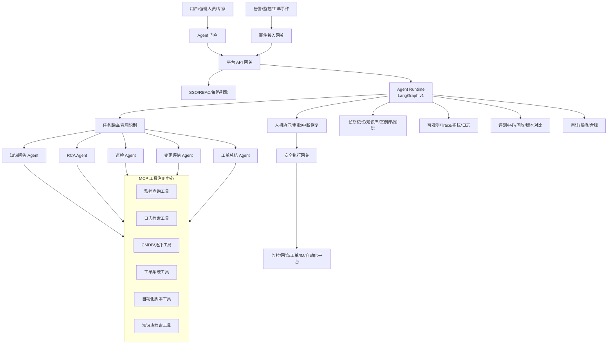
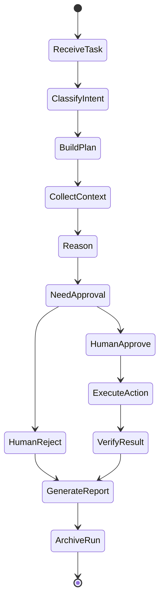

# 软件设计说明书：智能运维 Agent 平台

项目周期：2025.10 - 至今  
项目定位：面向多运维场景的 Agent 平台化底座  
目标用户：平台管理员、Agent 开发者、运维专家、一线运维工程师、NOC 值班长、安全审计人员

## 1. 项目背景

在 RAG 知识库和基站告警 RCA Agent 建成后，多个专业线开始提出类似需求，例如例行巡检、变更风险评估、工单总结、故障复盘、容量分析和知识自动沉淀。如果每个场景都单独开发 Agent，会导致工具接入重复、权限模型不统一、审计不可控、评测不可复用、Prompt 和模型版本难以管理。

本项目将前两个项目沉淀出的能力平台化，建设智能运维 Agent 平台。平台提供统一的 Agent Runtime、MCP 工具注册中心、人机协同、权限审计、可观测、评测回放和模板管理能力，使不同运维场景可以快速构建受控 Agent。

## 2. 建设目标

功能目标：

- 支持多个 Agent 模板，包括知识问答、RCA、巡检、变更评估、工单总结和故障复盘。
- 支持基于 LangGraph v1 的长运行、有状态、可恢复 Agent 编排。
- 支持 MCP/FastMCP 工具注册、工具 Schema 管理、权限控制和健康检查。
- 支持人机协同，包括审批、中断、补充信息、拒绝执行和恢复执行。
- 支持全链路审计和可观测，包括用户输入、模型输出、工具调用、证据链和审批记录。
- 支持 Agent 评测中心，进行历史事件回放、标准任务集评测和版本对比。
- 支持知识回流，将确认后的 RCA 报告和工单结论沉淀为候选知识。

非目标：

- 不允许平台默认绕过人工审批执行高风险生产变更。
- 不把所有运维流程都交给 LLM 决策。
- 不替代现有监控、工单、CMDB 和自动化系统，而是通过工具接入增强它们。

## 3. 总体架构



## 4. 技术栈

后端与平台：

- Python 3.10+
- FastAPI
- LangGraph v1
- MCP Python SDK / FastMCP
- PostgreSQL
- Redis
- Kafka
- Temporal/Celery/企业工作流引擎

前端：

- React/Next.js
- Ant Design
- ECharts

工具与数据：

- Milvus + Elasticsearch/OpenSearch：知识和案例检索
- Neo4j：拓扑图谱
- Prometheus/Grafana：指标和监控
- Elasticsearch/OpenSearch：日志检索
- 企业工单系统、CMDB、网管系统、IM 平台

治理与可观测：

- SSO/OIDC
- Casbin 或企业权限系统
- Vault/企业密钥管理
- OpenTelemetry
- Prometheus + Grafana
- Langfuse/LangSmith 或企业内部 LLM Trace 平台

部署：

- Kubernetes
- Helm/Kustomize
- GitLab CI/GitHub Actions/企业 CI

## 5. 核心模块设计

### 5.1 平台 API 网关

职责：

- 统一接收用户请求、事件请求和外部系统调用。
- 完成认证、鉴权、限流、审计和路由。
- 将请求转换为 Agent run。

关键能力：

- API Key、SSO Token、服务账号鉴权。
- 按用户、部门、Agent、工具进行限流。
- 为每次请求生成 trace_id 和 run_id。

### 5.2 Agent Runtime

职责：

- 管理 Agent 执行图。
- 支持长运行任务、状态持久化、失败恢复和人工中断。
- 支持并行子任务和结果汇总。
- 记录每个节点输入、输出和耗时。

设计原则：

- Agent 不是黑盒对话，而是可观察的工作流。
- 每个节点都有明确输入、输出、重试策略和失败策略。
- 高风险节点必须声明审批策略。

典型 Agent 状态：



### 5.3 MCP 工具注册中心

职责：

- 管理所有可被 Agent 调用的工具。
- 统一工具描述、输入输出 Schema、权限、风险等级和运行状态。
- 对工具调用进行鉴权、审计、限流和熔断。

工具元数据：

| 字段 | 说明 |
|---|---|
| tool_name | 工具名称 |
| description | 工具说明 |
| mcp_server | 所属 MCP Server |
| input_schema | 输入 JSON Schema |
| output_schema | 输出 JSON Schema |
| risk_level | readonly/suggest/approval_required/forbidden |
| timeout_ms | 超时时间 |
| retry_policy | 重试策略 |
| required_roles | 可调用角色 |
| audit_level | 审计级别 |

风险等级：

- readonly：只读查询，可自动调用。
- suggest：生成建议，不执行动作。
- approval_required：必须人工审批后执行。
- forbidden：禁止 Agent 调用。

### 5.4 人机协同模块

职责：

- 在 Agent 执行过程中发起人工审批或补充信息请求。
- 支持审批通过、拒绝、补充信息、转派专家和超时升级。
- 审批结果回写 Agent Runtime，恢复执行。

审批场景：

- 生产配置变更。
- 重启、切换、隔离等高风险动作。
- RCA 结论写回正式工单。
- 知识自动入库。
- 低置信度诊断需要专家确认。

### 5.5 Agent 模板管理

首批模板：

| Agent | 场景 | 核心工具 |
|---|---|---|
| 知识问答 Agent | SOP、手册、历史案例问答 | 知识库检索、文档定位 |
| RCA Agent | 告警根因分析 | 监控、日志、拓扑、工单、知识库 |
| 巡检 Agent | 周期巡检和异常摘要 | 监控、CMDB、巡检脚本 |
| 变更评估 Agent | 割接和参数变更风险分析 | CMDB、历史工单、知识库 |
| 工单总结 Agent | 工单归纳和复盘 | 工单、知识库、LLM 总结 |

模板内容：

- Agent 图定义。
- 节点 Prompt。
- 可用工具清单。
- 权限要求。
- 审批策略。
- 评测集。
- 输出报告模板。

### 5.6 可观测模块

职责：

- 记录 Agent 运行全过程。
- 统计平台健康度和模型调用质量。
- 支持线上问题复盘。

观测对象：

- 用户请求。
- Agent 节点。
- 模型调用。
- 工具调用。
- 证据引用。
- 审批流程。
- 最终报告。

关键指标：

| 指标 | 含义 |
|---|---|
| agent_run_success_rate | Agent 运行成功率 |
| tool_call_success_rate | 工具调用成功率 |
| approval_wait_time | 审批等待时间 |
| model_latency_p95 | 模型 P95 延迟 |
| tool_latency_p95 | 工具 P95 延迟 |
| report_acceptance_rate | 报告采纳率 |
| fallback_rate | 降级率 |

### 5.7 评测中心

职责：

- 管理标准任务集。
- 支持历史事件回放。
- 比较不同模型、Prompt、工具版本和 Agent 图版本。
- 输出评测报告。

评测类型：

- RAG 问答评测。
- RCA 历史故障回放。
- 工具调用正确性评测。
- 报告结构和引用完整性评测。
- 安全策略评测，例如是否绕过审批。

### 5.8 知识回流模块

职责：

- 将人工确认后的 RCA 报告、工单结论和专家修订意见沉淀为候选知识。
- 提交知识管理员审核。
- 审核通过后进入 RAG 知识库。

关键约束：

- 未审核内容不得直接进入正式知识库。
- 自动生成内容必须保留来源工单和确认人。
- 过期知识需要定期复核。

## 6. 数据模型

### 6.1 agent_definition

| 字段 | 类型 | 说明 |
|---|---|---|
| id | bigint | 主键 |
| name | varchar | Agent 名称 |
| type | varchar | qa/rca/inspection/change/ticket |
| graph_config | jsonb | 执行图定义 |
| prompt_version | varchar | Prompt 版本 |
| status | varchar | draft/published/disabled |
| owner | varchar | 负责人 |

### 6.2 agent_run

| 字段 | 类型 | 说明 |
|---|---|---|
| id | bigint | 主键 |
| run_id | varchar | 运行 ID |
| agent_id | bigint | Agent ID |
| user_id | varchar | 触发用户 |
| input | jsonb | 输入 |
| status | varchar | running/waiting_approval/succeeded/failed |
| model_version | varchar | 模型版本 |
| started_at | timestamp | 开始时间 |
| finished_at | timestamp | 结束时间 |

### 6.3 tool_registry

| 字段 | 类型 | 说明 |
|---|---|---|
| id | bigint | 主键 |
| tool_name | varchar | 工具名称 |
| mcp_server | varchar | MCP Server |
| input_schema | jsonb | 输入 Schema |
| output_schema | jsonb | 输出 Schema |
| risk_level | varchar | 风险等级 |
| status | varchar | enabled/disabled |
| owner | varchar | 负责人 |

### 6.4 tool_call_log

| 字段 | 类型 | 说明 |
|---|---|---|
| id | bigint | 主键 |
| run_id | varchar | Agent run |
| tool_name | varchar | 工具 |
| input | jsonb | 输入 |
| output_summary | text | 输出摘要 |
| status | varchar | success/failed/timeout |
| latency_ms | int | 耗时 |
| error_code | varchar | 错误码 |

### 6.5 approval_task

| 字段 | 类型 | 说明 |
|---|---|---|
| id | bigint | 主键 |
| run_id | varchar | Agent run |
| title | varchar | 审批标题 |
| risk_level | varchar | 风险等级 |
| requested_action | jsonb | 请求动作 |
| status | varchar | pending/approved/rejected/expired |
| approver | varchar | 审批人 |
| decision_comment | text | 审批意见 |

## 7. 接口设计

### 7.1 创建 Agent Run

POST `/api/v1/agent-runs`

```json
{
  "agent_name": "rca_agent",
  "input": {
    "incident_id": "inc_20260101001"
  },
  "options": {
    "stream": true,
    "require_approval": true
  }
}
```

### 7.2 查询 Agent Run

GET `/api/v1/agent-runs/{run_id}`

### 7.3 注册工具

POST `/api/v1/tools`

```json
{
  "tool_name": "query_prometheus_metric",
  "mcp_server": "monitoring-mcp",
  "risk_level": "readonly",
  "input_schema": {
    "type": "object",
    "properties": {
      "metric_name": {"type": "string"},
      "start_time": {"type": "string"},
      "end_time": {"type": "string"}
    },
    "required": ["metric_name", "start_time", "end_time"]
  }
}
```

### 7.4 审批任务处理

POST `/api/v1/approval-tasks/{task_id}/decision`

```json
{
  "decision": "approved",
  "comment": "允许执行只读巡检，不允许执行重启动作"
}
```

## 8. 权限与治理

角色设计：

| 角色 | 权限 |
|---|---|
| 平台管理员 | 管理平台配置、用户、角色、工具 |
| Agent 开发者 | 创建和发布 Agent 模板 |
| 运维专家 | 审核 RCA 报告、审批高风险动作 |
| 一线用户 | 使用已发布 Agent |
| 审计人员 | 查看审计日志和运行记录 |

治理策略：

- 工具最小权限。
- 高风险工具强制审批。
- Prompt、模型、工具和知识库版本全记录。
- 敏感字段脱敏。
- Agent 输出写回正式系统前必须校验权限。

## 9. 部署设计

Kubernetes 部署单元：

- platform-api
- agent-runtime
- event-gateway
- tool-registry
- mcp-gateway
- approval-service
- eval-service
- portal-web
- worker

依赖组件：

- PostgreSQL
- Redis
- Kafka
- Milvus
- Elasticsearch/OpenSearch
- Neo4j
- Prometheus/Grafana
- 模型推理服务

高可用设计：

- API 服务多副本。
- Agent 状态持久化，支持失败恢复。
- 工具调用超时、重试、熔断。
- 事件消费幂等。
- 关键数据定期备份。

## 10. 关键问题与解决方案

| 问题 | 影响 | 解决方案 |
|---|---|---|
| 多 Agent 重复开发 | 成本高 | 模板化和 Runtime 复用 |
| 工具接入不统一 | 权限和审计混乱 | MCP 工具注册中心 |
| Agent 行为不可解释 | 用户不信任 | Trace、证据链、节点轨迹 |
| 高风险动作误执行 | 生产事故 | 风险等级 + 人工审批 |
| Prompt/模型变更难复现 | 问题排查困难 | 版本化和历史 run 回放 |
| 错误知识自动回流 | 知识污染 | 候选知识池 + 专家审核 |

## 11. 验收标准

- 支持至少 3 类 Agent 模板接入。
- 支持 MCP 工具注册、鉴权、审计和健康检查。
- 支持 Agent 长运行状态持久化和人工审批恢复。
- 支持运行轨迹、模型调用、工具调用和证据链查看。
- 支持历史任务回放和版本对比评测。
- 高风险动作无法绕过审批直接执行。

